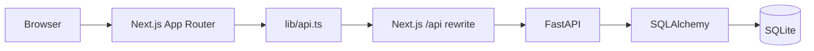

# Fireflies Clone

## Overview

A meeting intelligence workspace inspired by Fireflies.ai. Create and manage meetings, review timestamped transcripts, search meeting content, and track action items. The application uses a Next.js frontend, FastAPI backend, and SQLite database. It is an assignment/demo application and is not production-ready as deployed.

## Features

- Browse meetings; search by title or participant, filter by exact date, and sort by recency.
- Create meetings with participants and transcript text; upload `.txt` or `.md` transcript files in the browser (maximum 2 MB).
- View and edit meeting metadata and participants; delete meetings.
- Review transcript speaker labels and timestamps, search/highlight transcript text, and navigate between matches.
- Seek the meeting timeline by selecting transcript lines or topics; playback time highlights the active transcript segment.
- View summaries, topics/chapters, and action items.
- Create, edit, complete/reopen, and delete action items.
- Search globally across meeting titles, participant names, summaries, and transcript text at `/search`.
- Export transcripts and summaries as plain-text files.
- Loading, error, empty, validation, and success-notification states.

## Tech Stack

| Area | Technology |
| --- | --- |
| Frontend | Next.js 14 App Router, React 18, TypeScript 5.5, CSS |
| Backend | Python 3.10+, FastAPI, Pydantic, SQLAlchemy 2 |
| Database | SQLite |
| API | JSON over HTTP; Next.js rewrites `/api/*` to FastAPI by default |

Dependency manifests: [package.json](package.json) and [requirements.txt](requirements.txt).

## Architecture



The frontend uses typed API wrappers in `lib/api.ts`. FastAPI routes, validation, serialization, and global search are defined in `backend/app/main.py`. SQLAlchemy models and database/session configuration are in `backend/app/models.py` and `backend/app/database.py`. On startup, the backend initializes the schema and adds any missing demo fixtures.

Global search reads persisted meeting, participant, transcript, and summary data. It returns up to 50 matching meetings and at most five transcript excerpts per meeting. Meeting-library filters and transcript search within an open meeting are separate features.

## Project Structure

```text
app/
  page.tsx                    Meetings library
  search/page.tsx             Global search
  meetings/new/page.tsx       Meeting creation
  meetings/[id]/page.tsx      Meeting detail
  globals.css                 Application styles
components/
  meeting-card.tsx
  sidebar.tsx
  Toast.tsx
  meeting-detail/             Player, transcript, summary, topics,
                              action items, metadata editor, dialogs
lib/
  api.ts                      Typed backend requests
  types.ts                    API-facing TypeScript types
  download.ts                 Text export helpers
backend/app/
  main.py                     FastAPI application and routes
  models.py                   SQLAlchemy entities and relationships
  database.py                 Engine, sessions, schema initialization
  seed.py                     Demo fixtures
  transcript_parser.py        Transcript parsing
  init_db.py                  Database initialization CLI
  config.py                   Environment-based configuration
```

## Database Schema

| Table | Data |
| --- | --- |
| `meetings` | Title, date, duration, status, raw transcript, and timestamps; title/date is unique. |
| `participants` | Meeting participants, optional email and role; email is unique per meeting when provided. |
| `transcript_segments` | Meeting, optional participant, speaker, start/end time, text, and sequence. |
| `summaries` | Summary content associated with a meeting. |
| `meeting_topics` | Ordered topic/chapter title, time range, and optional notes. |
| `action_items` | Description, status, optional participant owner, and due date. |

Related rows are deleted with their meeting. SQLite foreign-key enforcement is enabled. Tables are initialized with SQLAlchemy `create_all`; there is no migration framework.

## API Endpoints

The API defaults to `http://127.0.0.1:8000`. Interactive documentation is available at `/docs` while the backend is running.

| Method | Endpoint | Purpose |
| --- | --- | --- |
| `GET` | `/health` | API/database health check |
| `GET` | `/api/meetings?q=&participant=&date=&sort=` | List, search, filter, and sort meetings |
| `GET` | `/api/search?q=` | Search titles, participants, summaries, and transcript segments |
| `GET` | `/api/meetings/{meeting_id}` | Get meeting details |
| `POST` | `/api/meetings` | Create a meeting |
| `PUT` / `DELETE` | `/api/meetings/{meeting_id}` | Update or delete a meeting |
| `GET` | `/api/meetings/{meeting_id}/transcript` | Get transcript segments |
| `GET` | `/api/meetings/{meeting_id}/summary` | Get the meeting summary |
| `GET` | `/api/meetings/{meeting_id}/action-items` | List action items |
| `POST` | `/api/meetings/{meeting_id}/action-items` | Create an action item |
| `PUT` / `DELETE` | `/api/action-items/{action_item_id}` | Update or delete an action item |

Meeting list filters are title `q`, participant name, exact `YYYY-MM-DD` date, and sort order. Global search requires a non-blank `q` of up to 200 characters. Meeting statuses are `scheduled`, `in_progress`, `completed`, and `cancelled`; action-item statuses are `open`, `in_progress`, `done`, and `blocked`.

## Local Setup

Requirements: Node.js/npm and Python 3.10 or later. Run commands from the repository root.

Install dependencies (PowerShell):

```powershell
py -3 -m venv .venv
.\.venv\Scripts\Activate.ps1
python -m pip install -r requirements.txt
npm install
```

Initialize SQLite and insert demo data:

```powershell
python -m backend.app.init_db
```

This command is safe to repeat and preserves user-created meetings outside recognized demo fixture keys. To deliberately refresh the known demo fixtures:

```powershell
python -m backend.app.init_db --refresh-demo
```

Refreshing resets edits to recognized fixtures; unrelated meetings are preserved. Do not use it if you need to retain custom records with a demo fixture's exact title and date.

## Environment Variables

| Variable | Default | Purpose |
| --- | --- | --- |
| `DATABASE_URL` | `sqlite:///./data/fireflies.db` | SQLite connection URL. Relative paths depend on the backend working directory. |
| `API_PROXY_TARGET` | `http://127.0.0.1:8000` | FastAPI destination for Next.js `/api/*` rewrites. |
| `NEXT_PUBLIC_API_BASE_URL` | Empty | Optional browser-facing API base URL. Leave unset to use the same-origin Next.js rewrite. This value is public configuration; do not put secrets here. |

The backend reads environment variables from the process environment; it does not load a `.env` file automatically. Example PowerShell configuration:

```powershell
$env:DATABASE_URL = "sqlite:///./data/fireflies.db"
$env:API_PROXY_TARGET = "http://127.0.0.1:8000"
```

For direct cross-origin browser requests, set `NEXT_PUBLIC_API_BASE_URL` and add the frontend origin to the FastAPI CORS allowlist in `backend/app/main.py`. The current allowlist contains only `http://localhost:3000` and `http://127.0.0.1:3000`.

## Running Frontend

With the backend running, start Next.js from the repository root:

```powershell
npm run dev
```

Open [http://localhost:3000](http://localhost:3000). To create a production build and run it:

```powershell
npm run build
npm start
```

`npm start` uses port 3000 unless `PORT` is set. Configure `API_PROXY_TARGET` before building/running when the API is not at its default address.

## Running Backend

From the repository root, initialize the database if needed, then start FastAPI:

```powershell
python -m backend.app.init_db
python -m uvicorn backend.app.main:app --reload --host 127.0.0.1 --port 8000
```

Check [http://127.0.0.1:8000/health](http://127.0.0.1:8000/health) or open [http://127.0.0.1:8000/docs](http://127.0.0.1:8000/docs).

## Seed Data

The seed script provides five demo meetings: Product Planning, Engineering Standup, Client Meeting, Sprint Review, and Marketing Discussion. Each includes timestamped transcript segments, participants, a summary, topics, and action items. The application seeds missing demo records on API startup.

`python -m backend.app.init_db` adds missing fixtures without duplicating them. Use `python -m backend.app.init_db --refresh-demo` only when you intend to reset the recognized demo records.

## Deployment

This repository does not include Docker, CI, or cloud-provider deployment manifests. A deployment requires a hosted Next.js app and a reachable FastAPI service:

1. Build and host Next.js with `npm run build` and `npm start`.
2. Run FastAPI with a production ASGI server, without `--reload`.
3. Set `API_PROXY_TARGET` to the API address and configure the production frontend origin/CORS if using direct browser requests.
4. Store SQLite on persistent writable storage and configure `DATABASE_URL`; ensure its parent directory exists.

SQLite is suitable for local/demo use and a single application instance. Before production use, add authentication and authorization, HTTPS/reverse-proxy controls, backups, migrations, and an appropriate database strategy. The API should not be exposed publicly in its current unauthenticated configuration.

## Assumptions

- The application uses one default workspace and assumes a default user; it has no sign-in, tenant separation, or real authorization.
- Meeting transcripts are supplied as text. Speaker labels and timestamps are parsed from supported transcript formats where possible.
- Meeting creation and editing use the existing API/database architecture; library, search, and meeting detail data are backend-backed.
- The default local API is `127.0.0.1:8000`, with Next.js proxying API requests on the same origin.

## Mocked Features

- No speech-to-text service is integrated. Text is pasted or loaded from a `.txt`/`.md` file and parsed deterministically.
- The meeting player uses a generated silent, seekable audio timeline. Actual meeting audio is not uploaded or stored.
- Seeded summaries/topics are demo data. New meetings without a supplied summary receive a placeholder; no LLM is used to generate summaries or topics.
- Profile, Notes, Settings, and external integrations are illustrative placeholders, not connected services.

## Limitations

- There is no authentication or authorization; do not expose the application publicly as-is.
- Transcript file input supports plain-text `.txt` and `.md` files up to 2 MB. Audio/video upload and transcription are not supported.
- Search in an open transcript is limited to its loaded segments. Global search covers meeting titles, participant names, summaries, and transcript text; library filters cover title, participant, and exact date.
- Summaries and topics cannot be edited in the UI. Action items support CRUD and status changes.
- SQLite schema creation uses `create_all`; there are no versioned migrations.
- No frontend/backend automated test suite or deployment manifests are configured. Verification commands:

  ```powershell
  npm run build
  npx tsc --noEmit
  python -m compileall -q backend/app
  python -c "from backend.app.main import app; print(app.title)"
  ```

## Screenshots

Screenshots are not included in this repository yet.

## Hosted Application

No hosted application URL has been provided.

## GitHub Repository

No GitHub repository URL has been provided.
